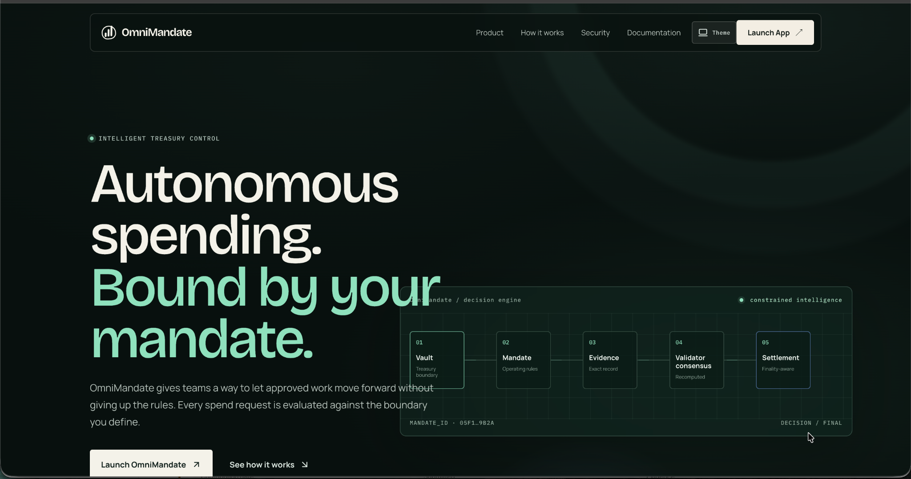
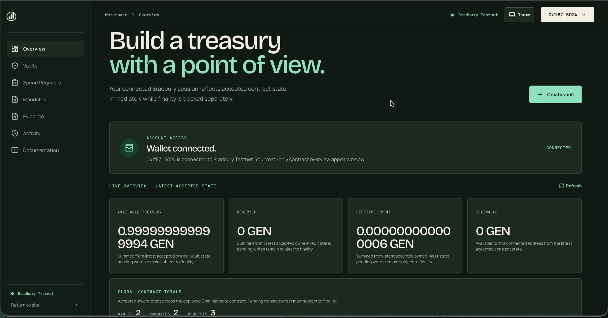
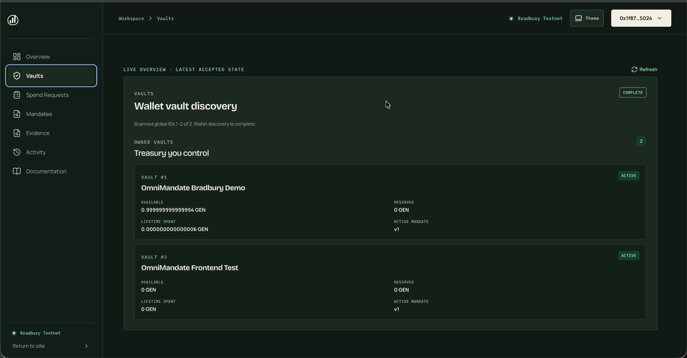
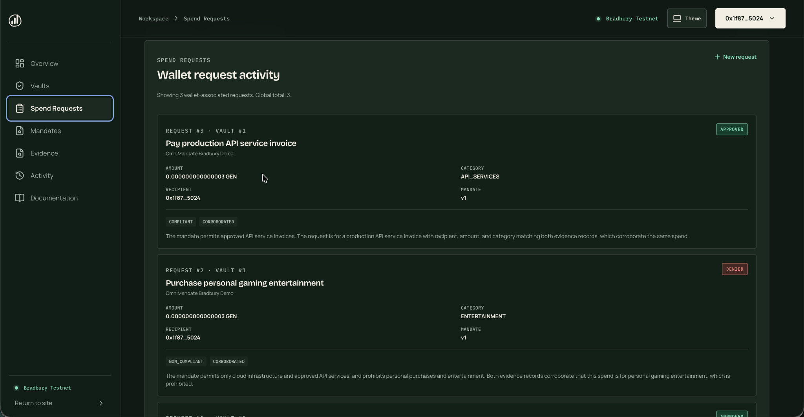
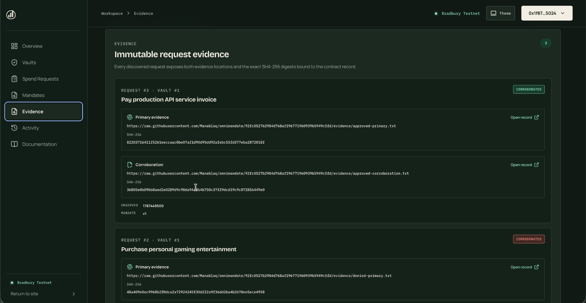

# OmniMandate

**Autonomous spending, bound by your mandate.**

OmniMandate is an intelligent treasury-control application on **GenLayer Bradbury Testnet**. A treasury owner defines a mandate, an authorized agent proposes an exact spend, evidence is bound to the request, validators evaluate policy compliance and evidence consistency, and the contract settles only the amount that was already fixed in the request.

[Launch the live app](https://omnimandate-i1am.vercel.app/) · [Reviewer guide](docs/REVIEWER_GUIDE.md) · [Bradbury verification](docs/BRADBURY_LIVE_VERIFICATION.md) · [Documentation index](docs/README.md)

> **Testnet warning**
> OmniMandate is deployed on GenLayer Bradbury Testnet. Testnet GEN has no implied mainnet value. This repository documents a testnet implementation and verification record, not a production custody service, investment product, or guarantee against loss.



## What OmniMandate solves

Autonomous agents can move quickly, but treasury control should not depend on an agent simply deciding that a payment is reasonable.

OmniMandate separates **proposal** from **authority**:

- a vault owner defines the operating boundary;
- an authorized agent can request a spend, but cannot rewrite the request during adjudication;
- primary and corroborating evidence are bound by URL and SHA-256 digest;
- validators independently evaluate the mandate and evidence;
- deterministic contract logic turns the bounded decision into either the exact request amount or zero;
- accepted state is surfaced quickly while protocol finality is tracked separately.

The result is an auditable treasury-control loop where intelligence can interpret evidence without gaining authority to invent payment amounts.

## Core safety invariant

> **The validator never chooses the payment amount.**

The agent proposes a fixed recipient, amount, purpose, category, mandate version, and evidence record. Validator output is bounded to policy/evidence status. Contract code can credit the immutable request amount or credit zero; it does not ask a validator or language model to calculate an arbitrary payout.

This invariant is central to the [v1 specification](docs/SPEC_V1.md), [architecture](docs/ARCHITECTURE.md), and [threat model](docs/THREAT_MODEL.md).

## How it works

```text
Vault
  ↓
Versioned mandate
  ↓
Exact spend request
  ↓
Primary + corroborating evidence
  ↓
Independent validator evaluation
  ↓
Deterministic contract settlement
  ↓
Accepted state → protocol finality → withdrawal
```

### 1. Create a vault

The owner creates a treasury vault, funds it with GEN, identifies an authorized agent, and installs the first versioned mandate.

### 2. Bind operating rules

A mandate defines the categories, limits, budget period, evidence expectations, and other spending constraints that the request must satisfy.

### 3. Submit an exact request

The agent submits an immutable recipient, amount, purpose, category, evidence references, and evidence digests. The amount is fixed before nondeterministic evaluation begins.

### 4. Evaluate evidence

GenLayer validators independently inspect the mandate and evidence. Evidence status and policy status are recomputed rather than accepted from an agent-provided conclusion.

### 5. Settle deterministically

A compliant, sufficiently corroborated request can be approved for its exact fixed amount. A non-compliant or failed request settles to zero.

### 6. Track finality separately

The frontend deliberately distinguishes **accepted** from **finalized**. Accepted state can be shown for responsive UX, but it is never described as irreversible finality.

## Verified status

| Area | Verified state |
| --- | --- |
| Network | GenLayer **Bradbury Testnet** |
| Intelligent Contract | Deployed and frozen |
| Contract address | `0x04c1E361ec0Da96a263794F1f582989c2419267C` |
| Frozen contract SHA-256 | `adee3cc8fa24d636321b06f5779ecc8356fde99db9194f188b757d6e0fd71076` |
| Direct Mode regression suite | **84 / 84 passed** |
| GenVM checks | lint / validation / normal typecheck / ABI generation verified |
| Live Bradbury approval path | Verified |
| Live Bradbury denial path | Verified |
| Finality handling | Verified |
| Finalized withdrawal path | Verified |
| Frontend | Live on Vercel and connected to Bradbury |
| Frontend quality gates | lint / production build / TypeScript / `npm audit` verified |
| Latest documentation review | 2026-08-23 |

The complete live-network record is in [BRADBURY_LIVE_VERIFICATION.md](docs/BRADBURY_LIVE_VERIFICATION.md). Test scope and evidence boundaries are documented in [TEST_MATRIX.md](docs/TEST_MATRIX.md).

## Live application

**Production:** https://omnimandate-i1am.vercel.app/

The application is organized as a real workspace with one active view at a time:

- Overview
- Vaults
- Spend Requests
- Mandates
- Evidence
- Activity
- Documentation

The UI uses an explicit wallet session, read-only Bradbury discovery for account state, injected-wallet writes for user-authorized transactions, and a separate transaction journey for acceptance and finalization.



### Vaults

The Vaults view discovers vaults associated with the connected account and shows accepted-aware balances, reserved amounts, lifetime spend, and active mandate version.



### Spend requests

Requests expose both approved and denied outcomes, the bound amount/category/recipient, mandate version, and the validator-derived compliance/evidence result.



### Evidence

Evidence is visible as a first-class contract record: immutable evidence URLs, SHA-256 digests, observation time, and mandate version are presented together.



For the complete current UI tour, see [PRODUCT_WALKTHROUGH.md](docs/PRODUCT_WALKTHROUGH.md).

## Architecture

OmniMandate is split into three reviewable layers:

```text
┌──────────────────────────────┐
│ Next.js / React frontend     │
│ wallet UX + read discovery   │
└──────────────┬───────────────┘
               │ GenLayer RPC / wallet
┌──────────────▼───────────────┐
│ OmniMandate Intelligent      │
│ Contract                     │
│ deterministic authority +    │
│ bounded nondeterminism       │
└──────────────┬───────────────┘
               │ validator evaluation
┌──────────────▼───────────────┐
│ Public, versioned evidence   │
│ + SHA-256 bindings           │
└──────────────────────────────┘
```

Key design properties:

- contract assertions enforce authorization;
- evidence is referenced and hashed before adjudication;
- the contract owns monetary authority;
- validator outputs are constrained;
- approved and denied paths are both explicit;
- accepted state and finality are distinct;
- withdrawal transfers only finalized claimable value.

See [ARCHITECTURE.md](docs/ARCHITECTURE.md) for the full system model.

## Technology

### Intelligent Contract

- Python Intelligent Contract
- GenLayer / GenVM
- Direct Mode regression testing
- GenVM linter / validation / typecheck / ABI generation

### Frontend

- Next.js 16.3.2
- React 19
- TypeScript 5
- `genlayer-js`
- viem / wagmi
- Motion / Radix / Lucide
- Light / Dark / System themes
- Vercel production deployment

## Development

### Contract environment

```bash
python3 -m venv .venv
source .venv/bin/activate

python3 -m pip install --upgrade pip
python3 -m pip install -r requirements-dev.txt

python3 -m pytest -q
genvm-lint check contracts/omnimandate.py
genvm-lint typecheck contracts/omnimandate.py
genvm-lint schema contracts/omnimandate.py --output abi.json
```

The known verified Direct Mode baseline is **84 / 84 passing tests**.

### Frontend

```bash
cd frontend
npm ci
npm run lint
npm run build
npx tsc --noEmit
npm audit
```

Run locally:

```bash
npm run dev
```

Then open `http://localhost:3000/` or `http://localhost:3000/app`.

## Reviewer quick path

A reviewer does not need to create new Bradbury transactions to understand the project.

1. Open the [live application](https://omnimandate-i1am.vercel.app/).
2. Enter the workspace and inspect Overview, Vaults, Spend Requests, Mandates, Evidence, Activity, and Documentation.
3. Review the frozen contract source at [`contracts/omnimandate.py`](contracts/omnimandate.py).
4. Verify the contract hash.
5. Review [BRADBURY_LIVE_VERIFICATION.md](docs/BRADBURY_LIVE_VERIFICATION.md).
6. Review [TEST_MATRIX.md](docs/TEST_MATRIX.md) and [RUNTIME_COMPATIBILITY.md](docs/RUNTIME_COMPATIBILITY.md).
7. For a concise evidence map and safe verification commands, use [REVIEWER_GUIDE.md](docs/REVIEWER_GUIDE.md).

## Security model

OmniMandate assumes that intelligence can be useful for interpreting real-world evidence, but it should not own unchecked treasury authority.

Important controls include:

- strict owner/authorized-agent boundaries;
- fixed request amounts before adjudication;
- explicit mandate versions and hashes;
- evidence URL and SHA-256 bindings;
- independent validator recomputation;
- deterministic approval/denial settlement;
- claimable-balance accounting;
- finality-aware withdrawal;
- no private key embedded in the public frontend;
- read-only account discovery separate from wallet-authorized writes.

Read [THREAT_MODEL.md](docs/THREAT_MODEL.md) and [SECURITY.md](SECURITY.md) before modifying security-sensitive behavior.

## Operational guidance

When using or extending OmniMandate:

- confirm you are on **Bradbury Testnet** before signing;
- verify the deployed contract address rather than trusting a copied UI value;
- treat **ACCEPTED** and **FINALIZED** as different states;
- keep evidence public, immutable/versioned where possible, and independently corroborated;
- never put credentials, private URLs, API keys, seed phrases, or private keys into evidence;
- write mandates with explicit categories, limits, periods, and failure behavior;
- preserve the rule that validators classify a fixed request rather than inventing monetary values;
- re-run the full regression suite after any contract change;
- update screenshots and verification documents whenever user-visible behavior changes.

## Current limitations

- Bradbury testnet only; no mainnet deployment is claimed.
- Evidence quality still depends on public source availability and the quality of the bound records.
- Validator consensus is not described as omniscient truth; the contract constrains how consensus can affect funds.
- Accepted state can precede finality.
- The current frontend is a reviewer/demo-grade public application, not a claim of audited production custody infrastructure.
- No external security audit is claimed.
- No repository license is added by this documentation update; absent a license, normal copyright restrictions apply.

## Repository structure

```text
contracts/                   OmniMandate Intelligent Contract
frontend/                    Next.js public application
tests/                       Direct Mode regression suite
scripts/                     reproducible verification tooling
docs/                        specification, architecture, security, and evidence
docs/assets/screenshots/     current application screenshots
requirements-dev.txt         development dependencies
requirements-lock.txt        verified dependency snapshot
README.md                    public project overview
SECURITY.md                  vulnerability reporting and security guidance
CONTRIBUTING.md              contribution workflow
```

## Documentation

Start with [docs/README.md](docs/README.md).

Primary reviewer documents:

- [Product walkthrough](docs/PRODUCT_WALKTHROUGH.md)
- [Reviewer guide](docs/REVIEWER_GUIDE.md)
- [v1 specification](docs/SPEC_V1.md)
- [Architecture](docs/ARCHITECTURE.md)
- [Threat model](docs/THREAT_MODEL.md)
- [Test matrix](docs/TEST_MATRIX.md)
- [Runtime compatibility](docs/RUNTIME_COMPATIBILITY.md)
- [Bradbury live verification](docs/BRADBURY_LIVE_VERIFICATION.md)
- [Deployment](docs/DEPLOYMENT.md)

## Contributing

See [CONTRIBUTING.md](CONTRIBUTING.md). Contract changes require a fresh full verification cycle and must never be presented as equivalent to the frozen Bradbury deployment until separately deployed and verified.

## Security

Please follow [SECURITY.md](SECURITY.md) for vulnerability reporting and responsible testing guidance. Do not publish secrets or exploit details in a public issue.

## License

This repository does not add a software license through this documentation update. Public source availability alone does not grant permission to use, modify, or redistribute the project. If the maintainer wants the project to be open source under a specific license, that choice should be made deliberately and documented with a `LICENSE` file.

---

**OmniMandate** — intelligent treasury control where autonomous execution remains bounded by explicit authority.
