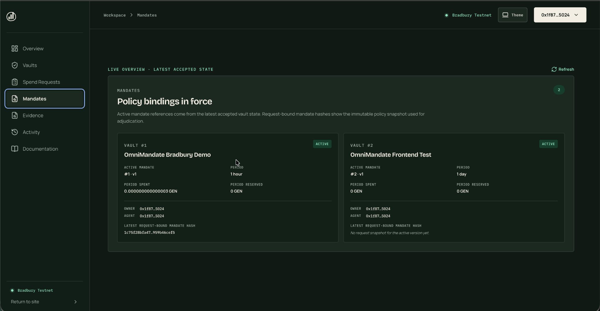
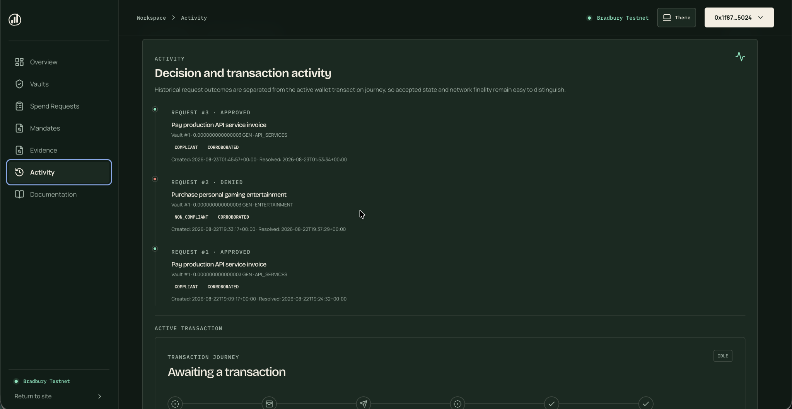
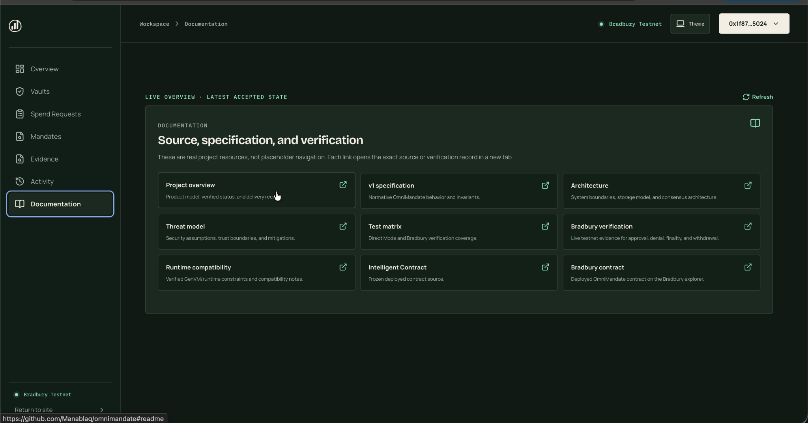

# Product Walkthrough

This walkthrough documents the current OmniMandate interface prepared for the final submission package on **2026-08-23**.

The screenshots are reviewer-facing UI evidence. They show the current workspace and Bradbury-connected application state, but they do not replace the contract source, test suite, transaction records, or live verification report.

## 1. Landing page


The landing page explains the product model in one sentence: autonomous spending remains **bound by a mandate**. The visual decision engine communicates the intended flow from Vault → Mandate → Evidence → Validator consensus → Settlement.

Reviewer signals:

- clear product framing;
- direct entry into the live app;
- links to product, security, and documentation;
- Bradbury-focused messaging rather than a mainnet claim.

## 2. Workspace overview


The Overview view is intentionally separate from the detailed workspace views. It shows the connected Bradbury session, accepted-aware treasury totals, claimable balance, and global contract counts.

Important semantics:

- the UI says **latest accepted state**;
- it does not equate accepted state with finality;
- transaction finality is tracked separately;
- the connected address is shortened in the interface.

## 3. Vaults


Vault discovery displays vaults associated with the connected wallet. Each vault exposes:

- vault ID and title;
- ACTIVE/paused state;
- available balance;
- reserved balance;
- lifetime spent;
- active mandate version.

The screenshot shows the two current reviewer/demo vaults discovered by the connected account.

## 4. Spend Requests


Spend Requests surfaces both positive and negative outcomes instead of showing only the happy path.

The current records demonstrate:

- an approved API-services request;
- a denied personal-entertainment request;
- fixed amount, category, recipient, and mandate version;
- validator-derived `COMPLIANT` / `NON_COMPLIANT` status;
- evidence corroboration status;
- human-readable decision rationale.

This screen is particularly useful for reviewing the core OmniMandate claim: the same contract can enforce both approval and rejection under the same bounded decision model.

## 5. Mandates



The Mandates view makes policy versioning visible. For each discovered vault it exposes:

- active mandate ID and version;
- policy period;
- period spend;
- period reserved amount;
- owner and authorized agent;
- latest request-bound mandate hash when one exists.

A request-bound mandate hash ties an adjudicated request to the policy snapshot used for that decision.

## 6. Evidence


Evidence is not hidden behind a generic “AI decision” label. The interface exposes:

- primary evidence location;
- corroborating evidence location;
- SHA-256 digest for each record;
- evidence observation time;
- mandate version;
- corroboration result.

This makes the evidence binding directly inspectable by a reviewer.

## 7. Activity and transaction journey



The Activity view separates two concepts:

1. historical request outcomes; and
2. the active wallet transaction journey.

Historical entries show approved and denied requests with their compliance/evidence status and timestamps.

The transaction journey is designed to make the lifecycle explicit:

```text
Prepare
→ Wallet confirmation
→ Submitted
→ Consensus
→ Accepted
→ Finalized
```

The separation is intentional: **ACCEPTED is not FINALIZED**.

## 8. Documentation inside the app



The application itself links reviewers to the repository evidence:

- project overview;
- v1 specification;
- architecture;
- threat model;
- test matrix;
- Bradbury verification;
- runtime compatibility;
- frozen Intelligent Contract;
- Bradbury explorer record.

These are real links rather than placeholder navigation.

## Reviewer notes

The screenshots were supplied as current UI captures for the submission package after the workspace navigation was unified. They are stored at full reviewer-friendly resolution.

For proof of contract/runtime behavior use:

- [Bradbury live verification](BRADBURY_LIVE_VERIFICATION.md)
- [Test matrix](TEST_MATRIX.md)
- [Runtime compatibility](RUNTIME_COMPATIBILITY.md)
- [Reviewer guide](REVIEWER_GUIDE.md)

For security assumptions use:

- [Threat model](THREAT_MODEL.md)
- [`../SECURITY.md`](../SECURITY.md)
